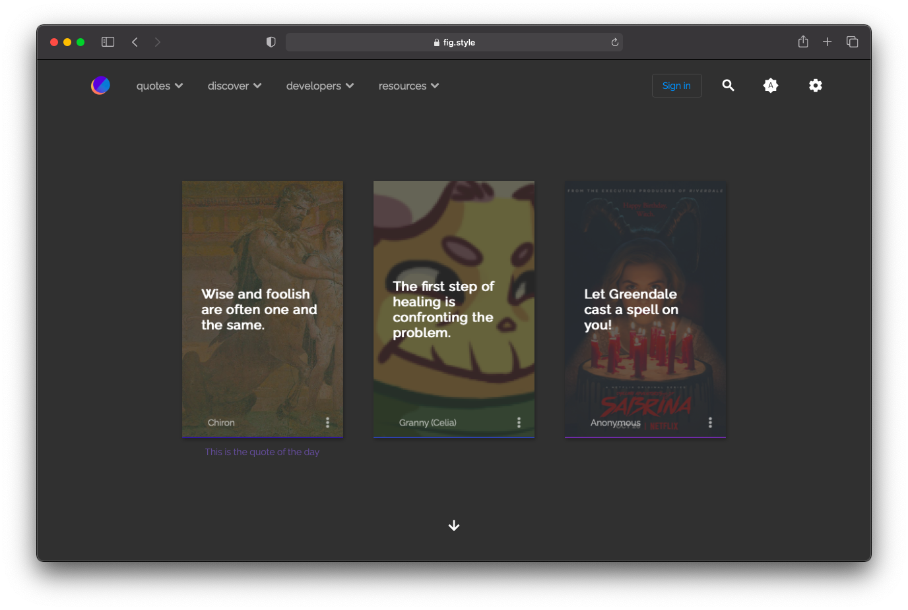
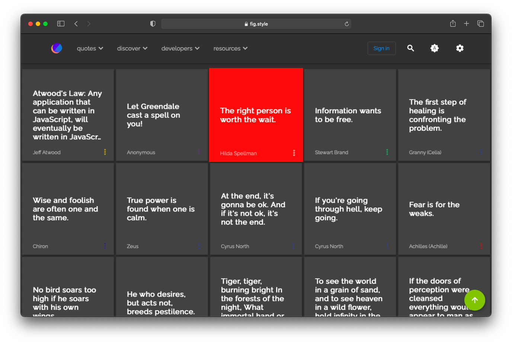
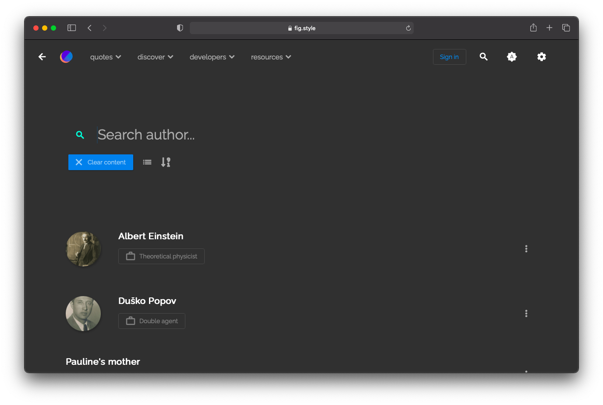
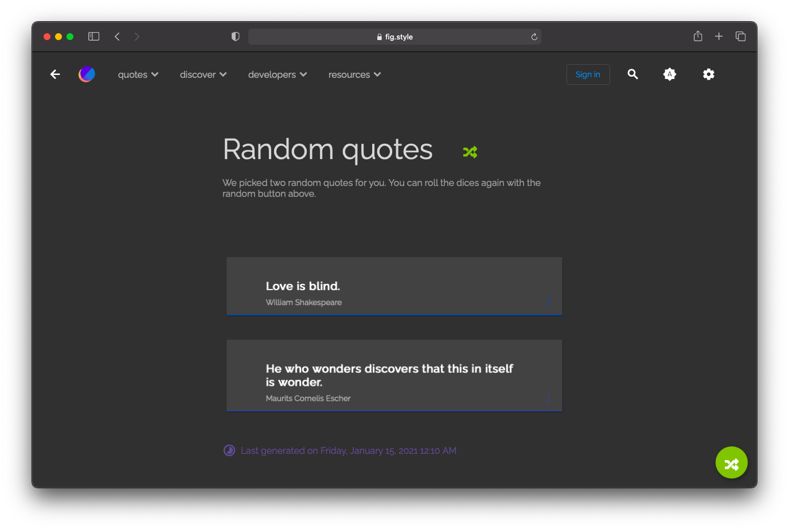

<p align="middle">
  
</p>

<p align="middle">5 seconds of emotion</p>

<p align="middle">
  
</p>

# Status


[](https://codemagic.io/apps/5fd420c277de1a00167ebea4/5fd420c277de1a00167ebea3/latest_build)

# Download

<span style="margin-right: 10px;">
  <a href="https://apps.apple.com/us/app/out-of-context/id1516117110?ls=1">
    
  </a>
</span>

<span style="margin-right: 10px;">
  <a href="https://play.google.com/store/apps/details?id=com.outofcontext.app">
    
  </a>
</span>

<span>
  <a href="https://fig.style">
    
  </a>
</span>
<br>
<br>
<br>

# Table of Contents

- [Status](#status)
- [Download](#download)
- [Table of Contents](#table-of-contents)
- [Presentation](#presentation)
  - [What's different from existing apps ?](#whats-different-from-existing-apps-)
  - [Technologies](#technologies)
    - [Frontend](#frontend)
    - [Backend](#backend)
    - [Authentication](#authentication)
    - [Cloud Functions](#cloud-functions)
- [How to add a quote](#how-to-add-a-quote)
  - [Basic rules](#basic-rules)
  - [Tips](#tips)
  - [Avoid](#avoid)
- [Sustainability](#sustainability)
- [Roadmap](#roadmap)
- [Contribute](#contribute)
    - [PLEASE READ](#please-read)
  - [Code styles](#code-styles)
    - [Dart class](#dart-class)
- [License](#license)
- [Privacy Policy](#privacy-policy)
- [Screenshots](#screenshots)

# Presentation

fig.style is a quotes app and service featuring one quote each day. It's available on web, Android, iOS & more to come. You can find quotes in English or French at the moment. More languages will be added later.

## What's different from existing apps ?

Its simplify and beautiful user interface is the first thing you will notice, but there are more. The goal is to make the app available everywhere someone would want to read a quote (mobile apps, web browsers, smartwatchs, chats, virtual assistant, ...) while sustaining high quality code. I want to minimize bugs.

Because I like building technologies with well-intended people, this app is open sourced and welcome contributions whatever its size. You can also just give your feedback or submit new quotes to the service. As a open source project management takes a lot of work and setup, you cannot run this app on you local environment yet. I'll have to develop and publish the API, create the developer admin panel and adapt the app's code first.

Even if this app is open source, its data is not, meaning you can't directly access to the database for security reasons. But you can interect with the data through the published apps and with the API soon.

About the data, this project is not only an app but also a quotes service. I want to build the simplest and most complete service possible. A service through its API, apps and extensions (e.g. Chrome/Firefox extensions), simple to start with thanks to REST endpoints (possibbly GraphQL and languages SDK later), complete because each quote can have an author, one or more references and some comments about the context.

Most quotes apps focus on books references but I often find outstanding quotes in Movies, TV series, Video Games, Animés, Comics, and so on. Today's culture is richer than ever and there're not good reason to limit ourselves to one medium.

## Technologies

### Frontend

I made the decision to go with [Flutter](https://flutter.dev) for the mobile app (Android/iOS) and web for this project after I gathered information on all available options to build a multiplatform app. It allowed to maintain a single code base and simplified the development in some cases. It also complicated the code architecture and the repository structure must be thoroughly managed.

### Backend

For the backend, the services uses [Firestore](https://firebase.google.com/docs/firestore) for online storage. It's a flexible, scalable database for mobile, web and server development from Firebase and Google Cloud Platform (this sentence is from their official website).

### Authentication

Firebase Auth handles users' account creation, connections, third-party authentication, email & password update, account deletion, among other scenarios.

### Cloud Functions

Firebase Cloud Functions is used for security checks when updating user's account for example. It's used for statistics too and for delayed deletion.

More about why and how I made these devlopment decisions in future [blog posts](https://rootasjey.dev).

# How to add a quote

You can freely add a quote to the app after creating an account. You can only add one quote per day but you can save the excedent as drafts. Next day you will be able to submit another quote.

## Basic rules

The service is manually handled and is not an automated process, so a human will read and validate your quote if it respect some basic rules:

* Your quote must be short (usually no more than 250 characters)
* It must be understandable
* It should provocate an emotion or welcome a reflexion

You may find these validation criterias not clearer enough and it's understandable because a quote's appreciation is completely subjective. A quote making you smile may not evoke the same emotion to someone else.

Thus, as a rule of thumb, I recommend to always submit your quote if you think it's good enough. You will always receive an explication if your quote is not accepted.

## Tips

We can't assure you than every submission will be accepted but you can improve your chances with these tips:

* Check the grammar, sentences' structure and ponctuation (a quote with a lot of mistakes is more likely to be rejected)
* Provide a valid author (and if this author doesn't already exist in the database, give a good amount of information - see existing authors' page to have an idea of what knowledge is useful)
* Give a valid reference (and if this reference doesn't already exist in the database, give a good amount of information - see existing references' page to have an idea of what knowledge is useful)
* Correctly categorize the quote with available topics
* Add a comment if the quote really needs some context

## Avoid 

On the contrary, a short list of usual rejections:

* Hard to understand due to missing or partial information
* Strong language, offensive words or ideas
* Too ordinary (the sentence doesn't have any particularity - e.g.: The sun is red)

If you still have doubts, you can always open an issue here or send us an email through the app.

> Whenever you're down, look up. It'll make your realize just how big and beautiful the world is.<br/> — **Emma Green** — Away

# Sustainability

In order to pay for the development cost, the app will use different sources of income.
Depending on which works the best, other sources may disapear. 

* The most straightforward will be ads but no ugly ones. They must not disturb the user experience or, at most, have little impact on it.
* Open Source sponsoring will be added through GitHub sponsor or Open Collective
* In-app purchases can be a little bonus for people wanting to support directly without leaving the app. It will also remove ads on top of adding custom Unsplash or hand drawing backgrounds.

# Roadmap

A better roadmap will be available later. For now, it's just a bullet list in this document.

* Start API development
* Third-party sign in (when Flutter web hashtag issue is solved in stale channel)

# Contribute

### PLEASE READ

> ⚠️ This project is in early development stage so the developer part hasn't been built yet. You won't be able to contribute at the moment without explicit authorization.

## Code styles

Repository code styles for better structure and reading.

### Dart class

Rules for dart classes.

* All imports at the top, ascending ordered alphabeticaly
* Variables declared at the top of the state

```dart
class _DashboardState extends State<Dashboard> {
  User userAuth;
  bool canManage = false;
  // ...
}
```

* Class methods in priority order:
  * Overrides (e.g. `initState`)
  * build method
  * Custom methods which return a widget
  * Other functions (e.g. auth functions, fetch data, ...)

# License

Mozilla Public License 2.0.

Please read the [LICENSE](./LICENSE) for more information.

Please [ask](mailto:github@fig.style) if you have any doubt.

# Privacy Policy

You can find the platform's privacy policy in this repo: [TOS.md](https://privacy.fig.style)

# Screenshots

The following screenshots was taken on the web application.

 _Home_ <br/><br/><br/>
 _Recent_ <br/><br/><br/>
 _Search_ <br/><br/><br/>
 _Random quotes_ <br/><br/><br/>

-------

<br/>
The following screenshots was taken on the mobile application.<br/>
Clicking on an author's name will show you their information.
<br/><br/><br/>

| Author | Search | Topics |
| ------ | ------ | ------ |
|  |  |  |